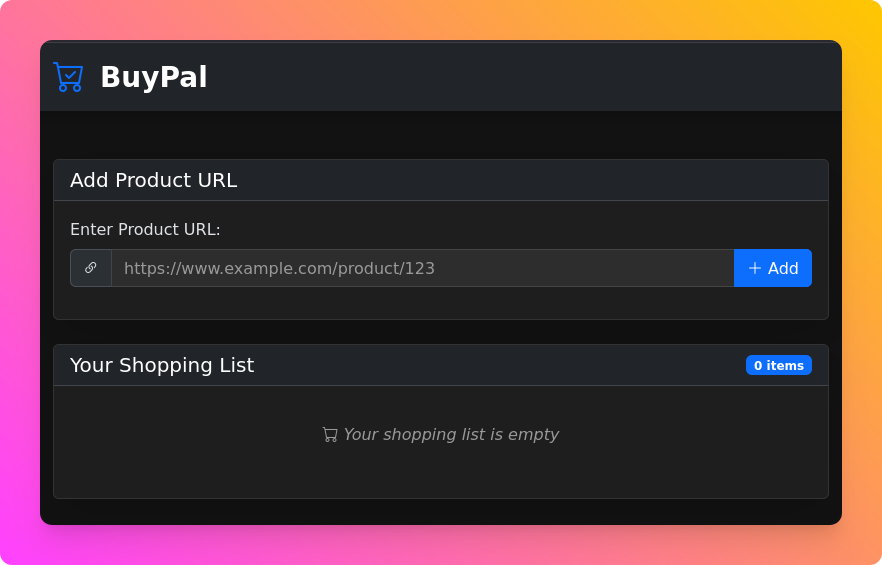

# BuyPal

An automation tool for stress-free online shopping experiences.

## Overview

BuyPal automates online purchases to reduce anxiety and decision fatigue. It handles the entire checkout process for you, from product selection to payment confirmation.



### Why BuyPal?

- Eliminates repetitive checking and verification steps
- Reduces decision paralysis during checkout
- Creates a predictable, consistent shopping experience
- Streamlines the purchase process from start to finish

> [!TIP]
> To use this tool, you'll need to log in manually and complete any additional security steps, such as MFA, validation, and facial recognition. This tool only handles the buying process.

### Web Interface

BuyPal includes a user-friendly web interface that allows you to:

1. Create a list of products you're considering
2. Let BuyPal randomly select one item from your list
3. Automatically complete the purchase process

To access the web interface, simply navigate to http://localhost:3000 after starting the server.

### Supported Platforms

- AliExpress
- MercadoLivre

## Quick Start

**Prerequisites:** Node.js (v22+) and Chrome

```bash
# Clone and setup
git clone https://github.com/thiagosanches/buypal.git
cd buypal
npm install
cp .env.example .env  # Configure with your credentials

# Run the application
google-chrome --remote-debugging-port=9222  --user-data-dir=user-data # In terminal 1
npm start  # In terminal 2

# Make a purchase
curl http://localhost:3000/buy/[domain]/[encoded-product-url]
```

## Security & Privacy

All sensitive information is stored locally in your `.env` file and never shared externally.

## Contributing

Contributions to improve the tool or add support for more platforms are welcome! Please submit PRs or open issues with suggestions.

## License

[MIT License](LICENSE)
git init
git add .
git commit -m "first commit"
git branch -M main
git remote add origin git@github.com:Guara-Tech/bp.git
git push -u origin main